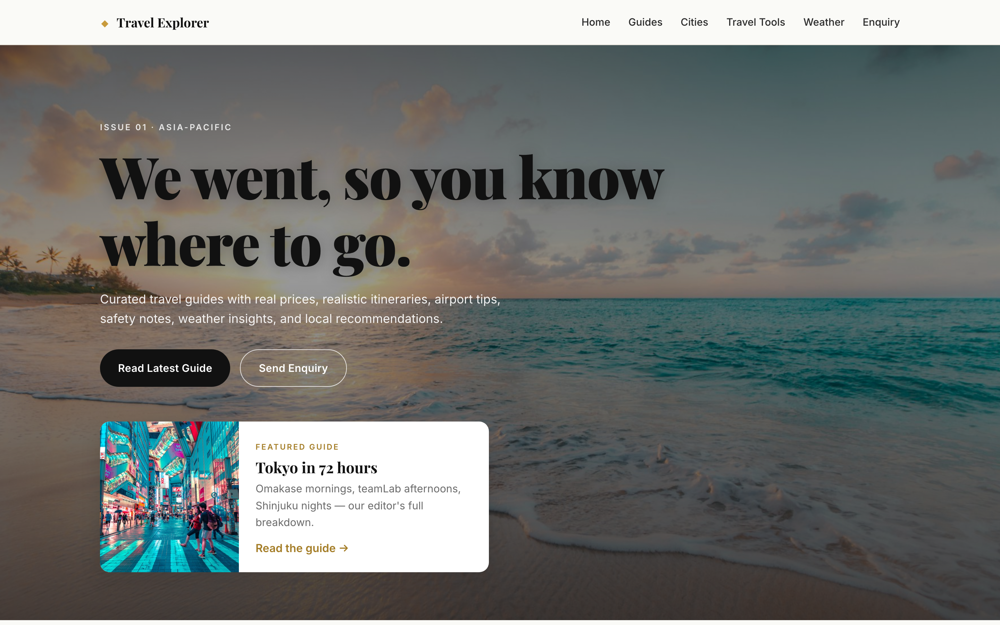

# Travel Explorer

A static travel guide website built with vanilla HTML, CSS, and JavaScript.

## Overview

This project contains a lightweight single-page travel guide featuring destination cards, editor's picks, weather widget support, and local storage persistence for enquiry and packing state.

## Files

- `index.html` — main page structure and layout
- `styles.css` — responsive styling and design tokens
- `app.js` — DOM rendering, modal handling, form enhancements, and weather logic
- `data/cities.js` — destination data used by the app
- `README.md` — project overview and usage notes
- `CLAUDE.md` — repository-specific guidance and architecture notes

## Usage

Open `index.html` directly in a browser. No build tools or server are required.

## Notes

- The app is designed to run from `file://`, so it does not use ES modules or package managers.
- `app.js` includes an OpenWeather API key placeholder; the widget falls back to mock data if not configured.
